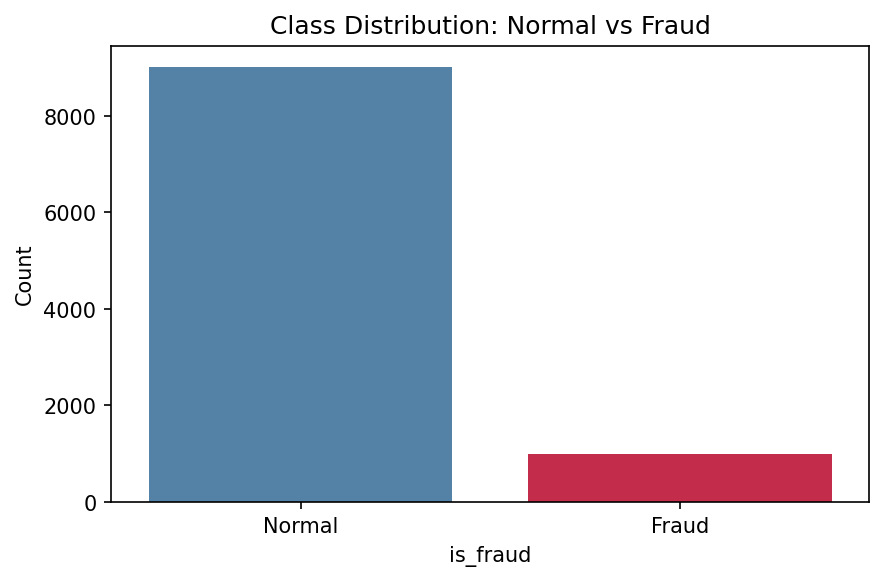
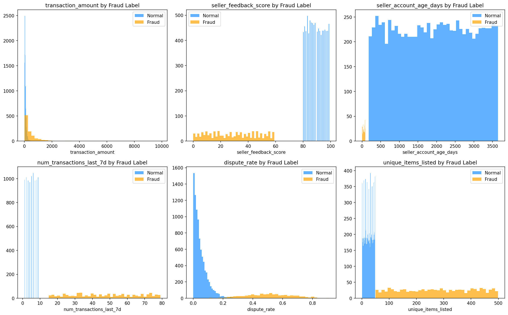

# 🔍 Fraud & Anomaly Detection in Online Marketplaces

## 📌 Project Overview

This project builds an end-to-end **fraud and anomaly detection pipeline** for online marketplace transactions. Using a synthetic dataset of 10,000 transactions (9,000 normal + 1,000 fraudulent), three unsupervised anomaly detection models are implemented, compared, and evaluated:

- **Z-Score** — statistical baseline
- **Isolation Forest** — tree-based anomaly detection
- **DBSCAN** — density-based clustering

The project covers the full data science workflow: exploratory data analysis, feature engineering, model training, evaluation, and visualization.

---

---

## 📊 Dataset

The dataset contains **10,000 synthetic marketplace transactions** with a **10% fraud rate**, designed to reflect realistic fraud patterns in e-commerce platforms.

| Feature | Description |
|---|---|
| `transaction_amount` | Order value in dollars |
| `seller_feedback_score` | Seller reputation score (0–100) |
| `seller_account_age_days` | Account age in days |
| `num_transactions_last_7d` | Transaction velocity (last 7 days) |
| `num_transactions_last_30d` | Transaction velocity (last 30 days) |
| `dispute_rate` | Ratio of disputed transactions |
| `return_rate` | Ratio of returned items |
| `num_policy_violations` | Count of policy breaches |
| `login_hour` | Hour of login activity |
| `unique_items_listed` | Number of unique listings |
| `is_fraud` | Label: 0 = Normal, 1 = Fraud |

---

## 🔍 Exploratory Data Analysis

### Class Distribution

### Feature Distributions — Normal vs Fraud

### Correlation Heatmap

---

## 🛠️ Feature Engineering

Six new features were engineered to enhance model performance:

| Feature | Formula | Intuition |
|---|---|---|
| `velocity_ratio` | `txn_7d / (txn_30d + 1)` | Detects burst activity |
| `trust_score` | `feedback * 0.6 + age_normalized * 0.4` | Combined seller trustworthiness |
| `is_night_login` | `1 if login_hour <= 5` | Flags suspicious login hours |
| `price_to_feedback_ratio` | `avg_price / (feedback + 1)` | High price, low trust signal |
| `risk_score` | `dispute_rate * 0.5 + return_rate * 0.5` | Combined risk indicator |
| `listing_intensity` | `items_listed / (account_age + 1)` | Mass listing on new accounts |

---

## 🤖 Models & Results

### Model Comparison

| Model | Precision | Recall | F1-Score | Accuracy | False Positives |
|---|---|---|---|---|---|
| Z-Score | 0.81 | 0.99 | 0.89 | 0.98 | 237 |
| **Isolation Forest** | **1.00** | **1.00** | **1.00** | **1.00** | **0** ✅ |
| DBSCAN | 0.92 | 1.00 | 0.96 | 0.99 | 90 |

---

### Z-Score — Confusion Matrix

### Isolation Forest — Confusion Matrix

### DBSCAN — Confusion Matrix

### Isolation Forest — Anomaly Score Distribution

---

## 🔑 Top Features by Fraud Separation Power

1. `risk_score` — strongest signal (dispute + return combined)
2. `seller_feedback_score` — clear gap between fraud and normal
3. `dispute_rate` — high dispute activity flags fraud
4. `num_transactions_last_7d` — velocity spikes
5. `unique_items_listed` — mass listing behaviour
6. `is_night_login` — engineered feature performing strongly

---

 
 

## 🧰 Tech Stack

- **Python 3.12**
- **pandas**, **numpy** — data manipulation
- **scikit-learn** — Isolation Forest, DBSCAN, preprocessing
- **scipy** — Z-score statistical baseline
- **matplotlib**, **seaborn** — visualization
- **Kaggle Notebooks** — development environment

---

## 👤 Author

**Azar Taheri**  
 
[LinkedIn](https://linkedin.com/in/azar-taheri)  | [Kaggle](https://www.kaggle.com/azartaheri)
